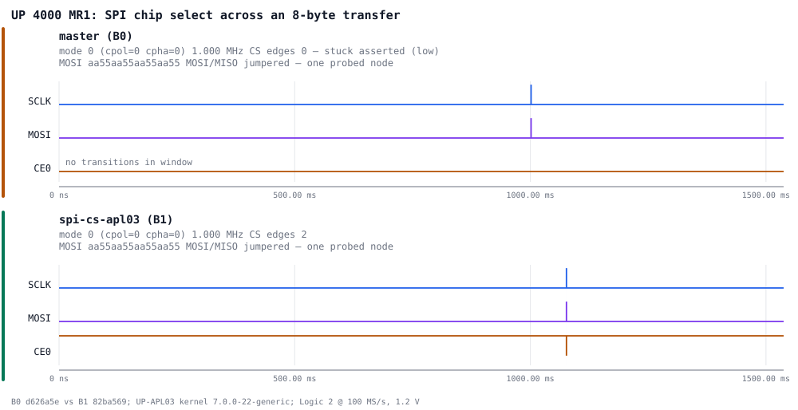
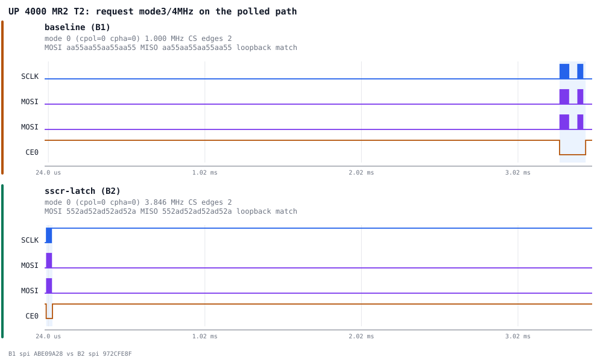
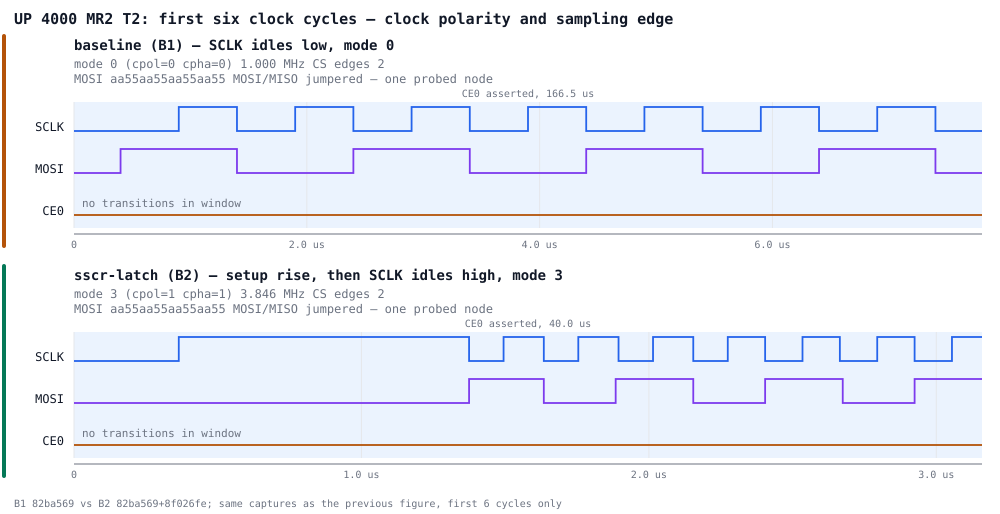
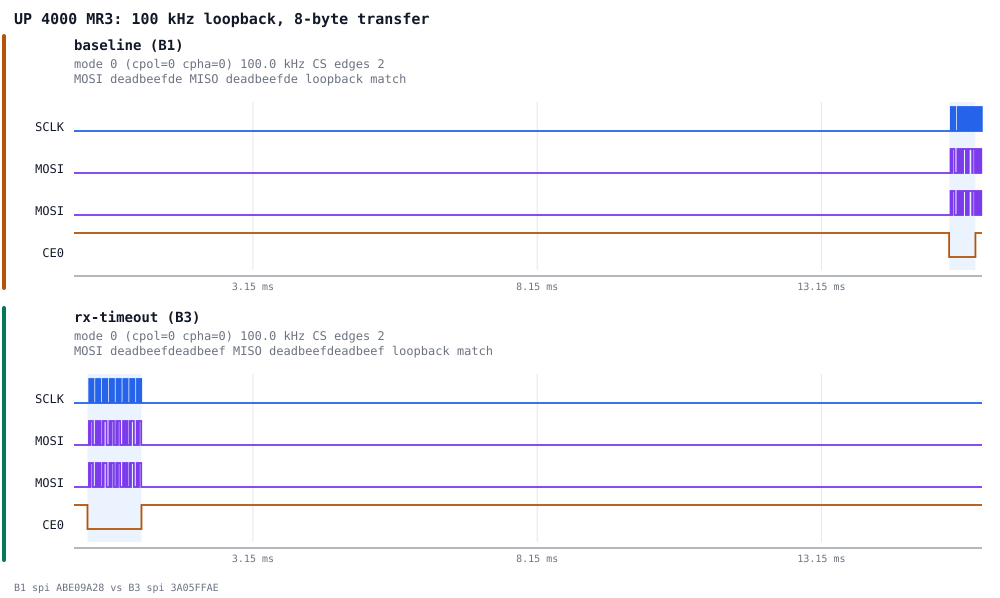

# UP 4000 SPI fixes — on-target validation report

On-target execution of `docs/testing/up4000-spi-test-plan.md`. Baseline-first,
before/after per MR. This directory holds every capture, its `analysis.json`,
`run.json`, raw `digital.csv`, `capture.sal`, and the target's own stdout, plus
before/after figures under [`figs/`](figs/).

Every number below is regenerated from the committed CSVs by
`../analysis/analyze_capture.py`, so a reader can reproduce the whole table
without the bench:

```sh
for d in mr*/*/*/; do
    python3 ../analysis/analyze_capture.py "$d/digital.csv" --json "$d/analysis.json" \
        --sclk SCLK --mosi MOSI --miso MOSI --cs "$(python3 -c 'import json,sys;print(json.load(open(sys.argv[1]))["cs_channel"])' "$d/analysis.json")"
done
```

## Bench & pipeline

- **Target:** UP-APL03 (board id 9), kernel `7.0.0-22-generic`, SSH host `up4000`.
- **Loopback:** header pins 19 & 21 jumpered → a single data node on Logic ch0.
  Channel map `MOSI=0, SCLK=2, CE0=4, CE1=5`. 100 MS/s, 1.2 V threshold, 20 ns
  device-side glitch filter.
- **Driver:** captures driven through `../analysis/capture_runner.py` (Logic 2
  automation API on `127.0.0.1`). `spi_case.py` runs one transfer per invocation
  (`<32 B` = polled path, `>=32 B` = long path) under `sudo` (spidev is `0600`).

**MOSI and MISO are one wire.** The jumper makes them a single probed node and
a single CSV column, so `loopback_match` would be true by construction. The
decoder now reports `loopback_shared_channel: true` and leaves `loopback_match`
null rather than emitting a tautology, and the figures say
"MOSI/MISO jumpered — one probed node". **Nothing in this report rests on
RX==TX at the analyser.** Where a round trip is the oracle — all of MR3 — it is
the *target's* `rx=` line from `run.json`, which is a genuine read back through
the driver.

## Build ladder & provenance

| Build | Contents | git base + picks |
|-------|----------|------------------|
| B0 | master | `d626a5e` |
| B1 | + MR1 spi-cs-apl03 | `82ba569` |
| B2 | B1 + MR2 sscr-latch | `82ba569` + `8f026fe` |
| B3 | B1 + MR3 rx-timeout | `82ba569` + `d81a226` |
| B4 | B1 + MR2 + MR3 | `82ba569` + `8f026fe` + `d81a226` |

Fixes were applied with `git cherry-pick --no-commit` (the target repo has no
committer identity; git config was **not** modified). MR2 and MR3 auto-merged
in `files/spi-pxa2xx.c` with **no conflict** (combined 32+/7-).

> **Provenance caveat — read before quoting a `srcversion`.**
> `capture_runner.py` collected `spi_srcversion` with
> `modinfo -F srcversion spi-pxa2xx-platform`, which names the **stock in-tree**
> module, not the out-of-tree `spi-pxa2xx-up` under test. Every one of the 49
> `run.json` files therefore carries the same value,
> `E759AE35E5DC9E50BE5AB76`, from B0 through B4. **No capture in this
> directory records which SPI build produced it.** The four distinct
> `spi-pxa2xx-up` srcversions quoted in the first draft of this report reached
> it out of band: three survive as free text inside `build_id` (read from
> `/etc/up-testbuild` at capture time), and B1's appeared in the report and
> nowhere else.
>
> The runner has been fixed to read `/sys/module/spi_pxa2xx_up/srcversion` —
> sysfs rather than `modinfo`, because `modinfo` reports what is installed
> under `/lib/modules`, not what is loaded — and to record a field it cannot
> read as `null` instead of dropping the key. **Re-running the ladder is what
> turns the build claim into evidence; until then it is an assertion.**
>
> What the captures *do* independently support: the behaviour changes between
> directories in exactly the way each fix predicts, on 49 captures taken over
> 90 minutes, and the boundaries line up with the reboots.

## MR1 — chip select restore (`spi-cs-apl03`), B0 → B1



| Measurement | B0 | B1 |
|---|---|---|
| CE0 transitions | 0 | 2 |
| CE1 transitions | 0 | 2 |
| CE0 / CE1 level when idle | constant **0** | 1 (released) |

On master neither chip select ever moves — and the level they hold is **0**,
which for an active-low select is *asserted*. Both selects sit permanently
selected while the bus clocks data, so on a two-device bus every device would
answer at once. That is a sharper statement than "the chip selects are dead",
and it is what the captures show: `cs_constant_level: 0` in
[`mr1/B0/ce0`](mr1/B0/ce0/analysis.json) and [`mr1/B0/ce1`](mr1/B0/ce1/analysis.json).

A logic capture cannot tell a driven low from an undriven line the analyser
reads as low, so the report claims only the level, not the mechanism.

With the fix both CE0 and CE1 frame their transfer (2 transitions each,
`aa55…` at 1 MHz mode 0). Captures: [`mr1/`](mr1/).

## MR2 — SSCR mode/clock latch (`sscr-latch`), B1 → B2





The second figure is the first six clock cycles of the same two captures. It is
the one that settles the mode: the baseline clock rests low and returns low,
while the patched one rises to its idle level before the burst — that wide high
plateau is the setup transition — and clocks from high. The panels are fitted
separately, so read the rate off the axis rather than the density.

T1–T5 run in sequence with no reload. Timestamps in `run.json` confirm the
order. Both halves of the request — mode and clock rate — are measured.

| Case | Path | Request | B1 measured | B2 measured |
|------|------|---------|-------------|-------------|
| T1 | polled | mode 0 / 1 MHz | mode 0, 1.000 MHz ✓ | mode 0, 1.000 MHz ✓ |
| T2 | polled | mode 3 / 4 MHz | **mode 0, 1.000 MHz** ✗✗ | mode 3, 3.846 MHz ✓ |
| T3 | long (40 B) | mode 3 / 4 MHz | mode 3, 3.846 MHz ✓ | mode 3, 3.846 MHz ✓ |
| T4 | polled | mode 3 / 4 MHz | **mode 0**, 3.846 MHz ✗ | mode 3, 3.846 MHz ✓ |
| T5 | polled | mode 0 / 1 MHz | mode 0, **3.846 MHz** ✗ | mode 0, 1.000 MHz ✓ |

Three independent demonstrations on the baseline:

- **T2** ignores the request wholesale and runs at T1's mode and rate.
- **T4** is the cleanest single data point. T3 immediately before it is a
  *long-path* transfer that put mode 3 at 4 MHz on the wire. T4 asks for the
  same mode 3 at the same 4 MHz on the *polled* path — and comes back at
  3.846 MHz in **mode 0**. The clock divisor carried over; the polarity did
  not. That asymmetry is exactly what Intel's text predicts for a port
  reconfigured with `SSE` set, and it cannot be explained by "the request was
  never applied", because the rate half of the same request was.
- **T5** asks for mode 0 at 1 MHz and gets 3.846 MHz, T4's rate.

On B2 every case matches its request in both mode and rate. B4 reproduces B2
exactly.

`3.846 MHz = 100 MHz / 26`, the integer-divisor rendering of a 4 MHz request.

The bonus replication: the un-primed [`mr3/B1`](mr3/B1/) sweep clocks **all
seven** requested speeds (25 kHz to 4 MHz) at 3.846 MHz. Seven more stale-latch
data points, collected for a different purpose.

### Why the first pass reported this wrong

The first analysis run reported `cpol=0` and a payload of `552ad52a…` for every
mode-3 transfer, and the report concluded that mode was unmeasurable on this
bench and fell back to clock frequency alone. Both were artefacts of one bug in
the decoder, now fixed and covered by regression tests.

The UP 4000 parks SCLK low between messages. A CPOL=1 transfer therefore opens
with a **setup rise** to the idle level, inside the chip-select window but a
long way from the burst — 1010 ns ahead of a 130 ns half-period in
[`mr2/B2/t2`](mr2/B2/t2/digital.csv). The decoder counted that rise as a clock
edge, which cost two separate measurements: the level ahead of the first edge
read as the parked level rather than the idle level, inverting CPOL; and the
extra sampling edge shifted every decoded byte by one bit, turning `aa55` into
`552a`.

`salcap.transaction_edges()` now drops setup and teardown transitions — an edge
whose gap to the burst exceeds 1.5× the median — and CPOL is read from the
level *after* the last clock edge, which nothing can masquerade as. The tell was
visible all along in the edge count: 129 where a 64-bit transfer needs 128.
With the trim, **all 15 MR2 captures decode as clean `aa55…` in every mode**,
which is itself a check on the fix.

## MR3 — Rx poll bound (`rx-timeout`), B1 → B3



Sweep is **primed** per speed (a long-path transfer at the same speed first —
required on B1/B3 because they lack the MR2 latch fix; see caveat 2).

| Speed | B1 primed: target `rx=` | B1: clock edges after CS released | B3 | B4 |
|-------|--------------------------|-----------------------------------|----|----|
| 4 M / 1 M / 500 k / 200 k | `deadbeefdeadbeef` ✓ | 0 | ✓ 0 | ✓ 0 |
| 100 k | **`00de00adbe00ef00`** | **49 of 128** | ✓ 0 | ✓ 0 |
| 50 k | **`00000000000000de`** | **113 of 128** | ✓ 0 | ✓ 0 |
| 25 k | **`0000000000000000`** | **127 of 128** | ✓ 0 | ✓ 0 |

The userspace symptom is the interleaved-zeros payload: the driver reads `SSDR`
before the data has arrived and returns the result **as success**. `exit 1`
below is `spi_case.py` comparing the bytes itself; the driver reported no error
at any speed, and `-ETIMEDOUT` never fired on any build.

**The symptom on the wire is worse, and this is new.** The controller releases
chip select while the SSP is still shifting. At 25 kHz CS is gone before the
second clock edge — 127 of the 128 edges arrive with the frame already closed.
A real slave sees the transaction torn mid-word; the loopback jumper is simply
the only device forgiving enough not to care. The count is
`clock_edges_after_frame` in each `analysis.json`. Across all 28 MR3 captures
it is **0 on every one of the 25 the target reported as success, and non-zero
on exactly the 3 it reported as mismatches** — perfect agreement with the
target's own verdict, from a signal measured independently of it.

This reframes MR3 from "a short read in one process" to "the driver violates
SPI framing", and it needs no loopback oracle at all, so it survives on a bench
with no jumper.

## MR4 — `debian/changelog` hygiene (no target)

Branch `debian-changelog` (`99a56a9`). Validated statically (no
`dpkg-parsechangelog` on this host): all 19/19 `--` trailers now carry the
mandatory blank-line stanza separator (on master they abutted the next header,
so `dpkg-parsechangelog` would see only the top entry); malformed
`17:39:45+0100 → 17:39:45 +0100` and impossible `Fri, 60 Jun 2023 →
Fri, 30 Jun 2023` both fixed.

## B4 — integration + regression

- **MR1 regression:** CE0 and CE1 both still frame their transfers (2
  transitions), neither stuck.
- **MR2:** T1–T5 all track request in both mode and rate, identical to B2.
- **MR3 (unprimed):** every speed clocks at its **request** (25 k → 25.000 kHz,
  no 3.846 MHz masking), no frame truncation, all `deadbeefdeadbeef`.
- **Integration payoff:** B4 needs **no priming crutch** — the MR2 fix latches
  the requested low speed directly on the polled path, so MR3's low speeds are
  genuinely exercised and pass. The two fixes reinforce rather than conflict.
- **Board health:** gpiochip4 = **28 lines** on every build; spidev nodes present.

## Methodology caveats

1. **MOSI and MISO are one node.** See the bench section — `loopback_match` is
   suppressed, and MR3's round-trip oracle is the target's `rx=`, not the
   analyser's.
2. **MR3 low-speed sweeps must be primed** on any build lacking the MR2 fix
   (B1, B3): without a preceding long-path transfer at the target speed, the
   polled path never re-latches the low clock and every case runs at
   ~3.846 MHz, masking the bug. B4 (has MR2) needs no priming.
3. **Figures are fitted per panel, not to a shared absolute window.** Two
   stacked captures are separate recordings and the same transfer sits at a
   different offset in each, so a shared absolute window mostly frames the gap
   between them. Each panel now fits its own transfer; panels keep a common
   *duration* when their natural spans are within 2× (MR1, MR3) and are fitted
   independently when they are not (MR2, where a 4× rate difference would
   otherwise squeeze the faster transfer to about a pixel per edge). Where the
   axes differ the title says so.
4. **A torn frame has no measurable mode.** CPOL is read from the level after
   the last clock edge inside the frame; when the frame closed early that level
   belongs to a transfer still in progress. The MR3 baseline figures say
   "mode not measurable (frame torn)" rather than printing a number.
5. **The `srcversion` provenance gap** above.

## Where this diverges from the test plan as written

Test plan §6 pre-registered a pass criterion for MR2 that the run did not meet,
and it is recorded here rather than quietly dropped. The plan predicted that on
B1 each polled case would **inherit the previous case's mode** — specifically
that T5 would measure CPOL=1. It does not: on B1 the polled path never leaves
CPOL=0, including immediately after T3 put CPOL=1 on the wire.

The measured behaviour is the stronger form of the same claim — the polled path
never gets the requested polarity onto the wire at all — but it is not what was
written down beforehand. The plan's §6 has been updated to match what the
hardware does.

## Known non-fatal boot warnings (noted, not chased)

- `pps_gpio_probe → upboard_gpio_irq_startup → request_threaded_irq` WARN
  (irq/manage.c:1502) — pre-existing pps-pin37 overlay on BCM26 (not an SPI pin);
  warn-once, identical across master and all branches.
- OOT-unsigned-module taint (`MODULE_SIG=n`) — expected for out-of-tree builds.
- B1-only transient `gpiochip_fwd_* Unknown symbol` at 1.65 s (modprobe
  load-order; re-probes clean at 5.86 s, id 9, 28 lines). Independent of the SPI
  diffs.

## Verdict

Behaviourally, all four MRs do what they claim on hardware: MR1 releases both
chip selects from a permanently-asserted state and frames transfers with them;
MR2 makes both mode and clock rate track the request on the polled path; MR3
stops both the silent short read and the torn frame; MR4 fixes the changelog;
and B4 shows the three code fixes coexist with no conflict and no regression.

The one thing this directory does **not** establish is the build ladder itself,
because the per-capture module fingerprint recorded the wrong module. That is a
re-run, not a re-test — the runner is fixed — and it should happen before these
captures are attached to an upstream issue.
